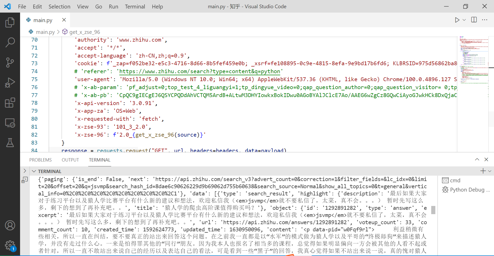

# 某乎x-zse-96签名算法python重写

具体的分析小小白大佬已经分析的非常详细了，就是按这个方法就可以得到最后的签名算法 

```
https://mp.weixin.qq.com/s/sVDHQeRY-774Jw70k7mINQ
```
网站
```
aHR0cHM6Ly93d3cuemhpaHUuY29tL3NlYXJjaD90eXBlPWNvbnRlbnQmcT1weXRob24=
```
## 签名的总体流程

```
source:101_3_2.0+/api/v4/search_v3?t=general&q=office&correction=1&offset=0&limit=20&filter_fields=&lc_idx=0&show_all_topics=0&search_source=Normal+"APAdT9SE4hSPTk_l1utlpb-FN6jTF5TgpSY=|1651578807"
```

`signature:sign(md5(source))`
sign方法
    1. `md5(source)` 后的字符串末尾补`\u0000` 通过`charCodeAt`从末尾开始得到3个数字一组的数字
        2. 3个数字作为参数通过`4种位运算`得到一个大数m
        3. `fixed_str = "RuPtXwxpThIZ0qyz_9fYLCOV8B1mMGKs7UnFHgN3iDaWAJE-Qrk2ecSo6bjd4vl5"`
            4个数字一组通过索引固定的字符串得到每组的四个字符， 比如任意一组的4个字符分别是 `fixed_str[m % 64],fixed_str[(m >> 6) % 64],fixed_str[(m >> 12) % 64],fixed_str[(m >> 18) % 64]`
        4. 拼接所有得到的字符串得到最后的签名

四种位运算的方式

```python
def m1(a, b, c): return ((a ^ 42) | (b << 8)) | (c << 16)
def m2(a, b, c): return (a | ((b ^ 42) << 8)) | (c << 16)
def m3(a, b, c): return (a | (b << 8)) | ((c ^ 42) << 16)
def m4(a, b, c): return (a | (b << 8)) | (c << 16)
```

其中第一组的a，b，c 分别为`a = ord(md5_str[32]) ``b = ord(md5_str[31]) ``c = ord(md5_str[30])`，后面的以此类推

## 补充知识学习

### 返回字符串字符的 Unicode 编码

```
// JavaScript
string.charCodeAt(index)
```
```
// python
ord(string[index])
```

### 位运算

| 含义 | 符号   | 例子                |
| ---- | ------ | ------------------- |
| 与   | a & b  | 0011 & 1011 = 0011  |
| 或   | a \| b | 0011 \| 1011 = 1011 |
| 异或 | a ^ b  | 0011 ^ 1011 = 1000  |
| 左移 | a <<b  | 0011 <<  2  = 1100  |
| 右移 | a >> b | 1100 >> 2 =  0011   |

另外发现B站的这个教程把位运算讲的**既明白又有趣**【《算法零基础入门》位运算-哔哩哔哩】 https://b23.tv/k2WoXqR


## 成功留念



## 源码

想了好久要不要放源码，最后放上来好了，不然怎么装一个具体的逼呢!

[具体见](./main.py)
注意
**代码仅用于科研学习之用，禁止商用，否则造成的后果与本人无关**
另外除了x-zse-96外，cookie和其他参数可以**短时间固定**,但有时会出现`x-zst-81`参数
