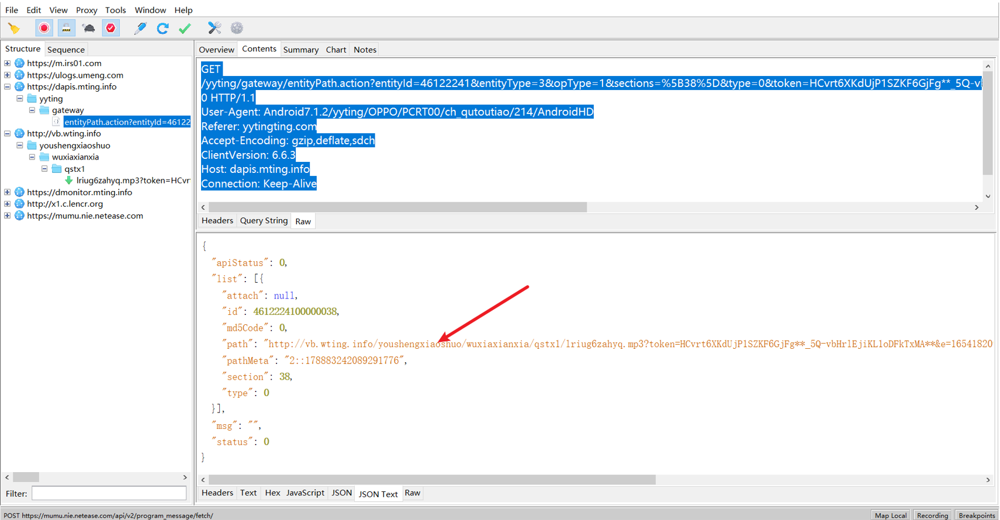
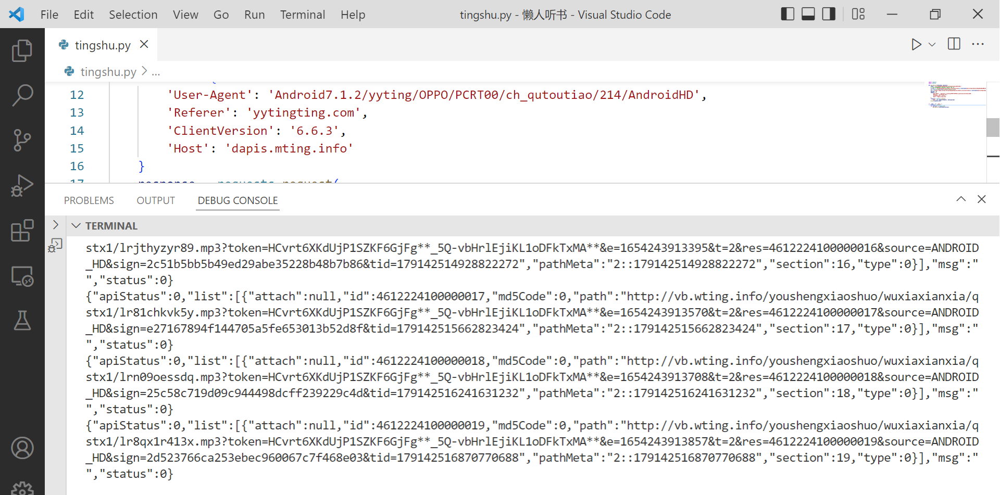

## 某听书sc参数
> sc参数用于对请求签名验证  

## 使用的工具

| 工具名                                          | 链接                                     |
| ----------------------------------------------- | ---------------------------------------- |
| jadx 用于反编译apk为java代码                    | https://github.com/skylot/jadx/releases/ |
| 逍遥模拟器 （初学安卓逆向先用模拟器，真机更好） | https://www.memuplay.com/tw/             |
| Frida 用于hook                                  | https://github.com/frida/frida           |
| Charles 或Fiddler 用于抓包                      |                                          |


## 抓包数据



目标是有声书的播放地址，所以是下面这个请求

```
GET /yyting/gateway/entityPath.action?entityId=46122241&entityType=3&opType=1&sections=%5B38%5D&type=0&token=HCvrt6XKdUjP1SZKF6GjFg**_5Q-vbHrlEjiKL1oDFkTxMA**&imei=bHJpZGEzRWxwMWU1TUw5M3F4bURCcFlibURnPT0%3D&nwt=1&q=377&mode=0&sc=c0ba56d16a055eeb60c166a32238c1f0 HTTP/1.1
User-Agent: Android7.1.2/yyting/OPPO/PCRT00/ch_qutoutiao/214/AndroidHD
Referer: yytingting.com
Accept-Encoding: gzip,deflate,sdch
ClientVersion: 6.6.3
Host: dapis.mting.info
Connection: Keep-Alive
```
经过多次抓包测试
entityId 是有声书的id
sections 有声书章节
token 登录的凭证（可以固定）
sc 其他参数变动时变动（后面知道是签名）
其他的可以固定

## 正向寻找
先使用jadx把apk反编译成java代码  
可以尝试搜`"sc"`，内容很多

```java
private HttpUrl.Builder a(tingshu.bubei.a.c cVar, HttpUrl httpUrl) {
        HttpUrl build = httpUrl.newBuilder().addQueryParameter(Constants.KEY_IMEI, cVar.c()).addQueryParameter("nwt", cVar.d()).addQueryParameter(WidgetRequestParam.REQ_PARAM_COMMENT_TOPIC, String.valueOf(cVar.e())).addQueryParameter(Constants.KEY_MODE, String.valueOf(cVar.f())).build().newBuilder().removeAllQueryParameters("sc").build();
        return build.newBuilder().addQueryParameter("sc", cVar.a(build));
    }

```

最后可以找到下面这段`cVar.a`是一个okhttp的拦截器点进去是一个接口，线索到这里就断了

如果根据sc的长度**猜测md5**，可以直接搜`java.security.MessageDigest`或`md5`
可以找到

```java
package tingshu.bubei.a;

import java.security.MessageDigest;

/* compiled from: MD5.java */
/* loaded from: classes4.dex */
public class d {
    public static String a(String str) {
        if (str == null) {
            return "";
        }
        try {
            MessageDigest messageDigest = MessageDigest.getInstance("MD5");
            messageDigest.reset();
            messageDigest.update(str.getBytes("UTF-8"));
            byte[] digest = messageDigest.digest();
            StringBuilder sb = new StringBuilder();
            for (int i = 0; i < digest.length; i++) {
                if (Integer.toHexString(digest[i] & 255).length() == 1) {
                    sb.append("0");
                    sb.append(Integer.toHexString(digest[i] & 255));
                } else {
                    sb.append(Integer.toHexString(digest[i] & 255));
                }
            }
            return sb.toString().toLowerCase();
        } catch (Exception unused) {
            return "";
        }
    }
}
```

然后查找用例可以找到
```java
package tingshu.bubei.a;

import android.net.Uri;
import java.util.Set;
import java.util.TreeMap;
import okhttp3.HttpUrl;

/* compiled from: ParamScGenerator.java */
/* loaded from: classes4.dex */
public class f {
    public static String a(HttpUrl httpUrl) {
        if (httpUrl.querySize() > 0) {
            HttpUrl b = b(httpUrl);
            // 核心md5位置
            return d.a((b.uri().getPath() + "?" + Uri.decode(b.uri().getRawQuery())) + "iJ0DgxmdC83#I&j@iwg");
        }
        // 核心md5位置
        return d.a(httpUrl.uri().getPath() + "iJ0DgxmdC83#I&j@iwg");
    }

    private static HttpUrl b(HttpUrl httpUrl) {
        Set<String> queryParameterNames = httpUrl.queryParameterNames();
        TreeMap treeMap = new TreeMap();
        HttpUrl.Builder newBuilder = httpUrl.newBuilder();
        for (String str : queryParameterNames) {
            newBuilder.removeAllQueryParameters(str);
            treeMap.put(str, httpUrl.queryParameter(str));
        }
        for (String str2 : treeMap.keySet()) {
            newBuilder.addQueryParameter(str2, (String) treeMap.get(str2));
        }
        return newBuilder.build();
    }
}
```

`d.a((b.uri().getPath() + "?" + Uri.decode(b.uri().getRawQuery())) + "iJ0DgxmdC83#I&j@iwg");`  

其中d.a就是md5，然后我们用frida来hook一下d.a，打印参数和返回值。

参数盲猜是请求url加上参数，但是我们不知道参数的拼接顺序，hook一下比较方便，当然可以研究一下下面两个，但是好像还是不知道参数的顺序，还是hook一下最方便。

```
public String getPath()
Returns the decoded path component of this URI.
The string returned by this method is equal to that returned by the getRawPath method except that all sequences of escaped octets are decoded.

Returns:
The decoded path component of this URI, or null if the path is undefined

public String getRawQuery()
Returns the raw query component of this URI.
The query component of a URI, if defined, only contains legal URI characters.

Returns:
The raw query component of this URI, or null if the query is undefined
```
## hook验证

hook代码
```python
import frida, sys

def on_message(message, data):
    if message['type'] == 'send':
        print("[*] {0}".format(message['payload']))
    else:
        print(message)

jscode = """
Java.perform(function () {
  let d = Java.use("tingshu.bubei.a.d");
  d["a"].implementation = function (str) {
      console.log('a is called' + ', ' + 'str: ' + str);
      let ret = this.a(str);
      console.log('a ret value is ' + ret);
      return ret;
};
});
"""

device = frida.get_remote_device()
process = device.attach("懒人听书")
script = process.create_script(jscode)
script.on('message', on_message)
print('[*] Running Hook')
script.load()
sys.stdin.read()
```

hook结果
```
a is called, str: /yyting/gateway/entityPath.action?entityId=46122241&entityType=3&imei=bHJpZGEzRWxwMWU1TUw5M3F4bURCcFlibURnPT0=&mode=0&nwt=1&opType=1&q=379&sections=[40]&token=HCvrt6XKdUjP1SZKF6GjFg**_5Q-vbHrlEjiKL1oDFkTxMA**&type=0iJ0DgxmdC83#I&j@iwg
a ret value is eeb445260d0fdde00d900c24d0f10256
```
验证了sc通过md5加密得到加密前的字符串`/yyting/gateway/entityPath.action?entityId=46122241&entityType=3&imei=bHJpZGEzRWxwMWU1TUw5M3F4bURCcFlibURnPT0=&mode=0&nwt=1&opType=1&q=379&sections=[40]&token=HCvrt6XKdUjP1SZKF6GjFg**_5Q-vbHrlEjiKL1oDFkTxMA**&type=0iJ0DgxmdC83#I&j@iwg`

## python模拟请求
```python
import requests
import hashlib


def get_paly_url(entityId, sections):
    token = 'HCvrt6XKdUjP1SZKF6GjFg**_5Q-vbHrlEjiKL1oDFkTxMA**'
    sc_raw = f'/yyting/gateway/entityPath.action?entityId={str(entityId)}&entityType=3&imei=bHJpZGEzRWxwMWU1TUw5M3F4bURCcFlibURnPT0=&mode=0&nwt=1&opType=1&q=377&sections=[{str(sections)}]&token={token}&type=0iJ0DgxmdC83#I&j@iwg'
    sc = hashlib.md5(sc_raw.encode()).digest().hex()
    url = f"https://dapis.mting.info/yyting/gateway/entityPath.action?entityId={str(entityId)}&entityType=3&opType=1&sections=[{str(sections)}]&type=0&token={token}&imei=bHJpZGEzRWxwMWU1TUw5M3F4bURCcFlibURnPT0%3D&nwt=1&q=377&mode=0&sc={sc}"
    payload = {}
    headers = {
        'User-Agent': 'Android7.1.2/yyting/OPPO/PCRT00/ch_qutoutiao/214/AndroidHD',
        'Referer': 'yytingting.com',
        'ClientVersion': '6.6.3',
        'Host': 'dapis.mting.info'
    }
    response = requests.request(
        "GET", url, headers=headers, data=payload, verify=False)
    print(response.text)


if __name__ == "__main__":
    entityId = 46122241
    for sections in range(1,20):
        get_paly_url(entityId,sections)
```


**成功留念**



## 其他经验总结

1. 可以一开始就hook md5就可以秒杀了
```javascript
Java.perform(function() {
    // MD SHA 
    var messageDigest=Java.use('java.security.MessageDigest');
    // update
    for(var i = 0; i < messageDigest.update.overloads.length; i++){
        messageDigest.update.overloads[i].implementation = function(){
            var name=this.getAlgorithm()
            send("================="+name+"====================");
            send(Java.use("android.util.Log").getStackTraceString(Java.use("java.lang.Throwable").$new()));
            
            for (var i = 0; i < arguments.length; i++) {
                send('messageDigest.update')
                send('JSON.stringify:' + JSON.stringify(arguments[i]))
                send('str:'+Java.use('java.lang.String').$new(arguments[i]))
            }
            var ret = this.update.apply(this, arguments)
        }
    }
    // digest
    for(var i = 0; i < messageDigest.digest.overloads.length; i++){
        messageDigest.digest.overloads[i].implementation = function(){
            var name=this.getAlgorithm()
            send("================="+name+"====================");
            send(Java.use("android.util.Log").getStackTraceString(Java.use("java.lang.Throwable").$new()));
            for (var i = 0; i < arguments.length; i++) {
                send('messageDigest.digestarguments:' + JSON.stringify(arguments[i]))
            }
            var ret = this.digest.apply(this, arguments)
            send('return:' + JSON.stringify(ret))
            send('str:'+Java.use('java.lang.String').$new(ret))
            // printInfo(ret)
            return ret
        }
    }
  
});
```

2. 可以同时hook Base64 AES RSA SHA1 SHA256等常见编码或加密就更为保险
3. jadx支持直接复制为frida片段


