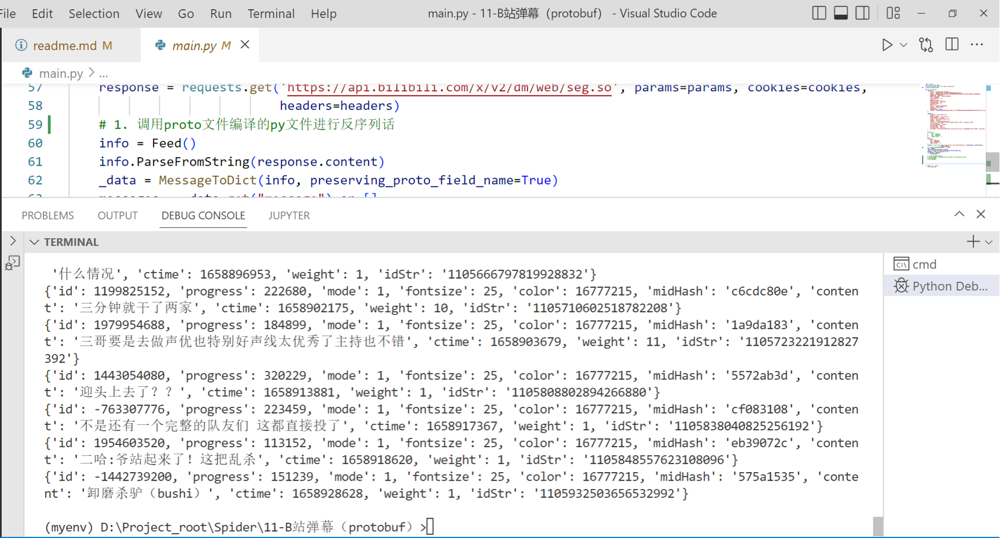
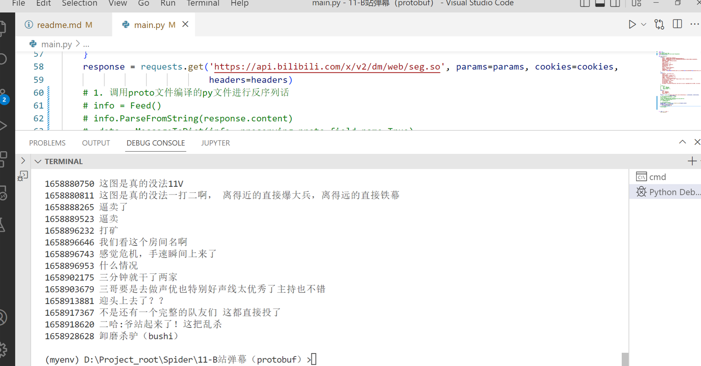

# B 站弹幕 protobuf 协议还原分析
> 根据链接 https://mp.weixin.qq.com/s/OzcjH8UXZl62p8TUgZQadg 修改
>
> https://developers.google.com/protocol-buffers/docs/pythontutorial


## Protobuf介绍
Protobuf (Protocol Buffers) 是谷歌开发的一款无关平台，无关语言，可扩展，**轻量级高效的序列化结构的数据格式**，用于将自定义数据结构序列化成字节流，和将字节流反序列化为数据结构。所以很适合做数据存储和为不同语言，不同应用之间互相通信的数据交换格式，只要实现相同的协议格式，即后缀为proto文件被编译成不同的语言版本，加入各自的项目中，这样不同的语言可以解析其它语言通过Protobuf序列化的数据。目前官方提供c++，java，go，python等语言支持。
**压缩程度高，相同量数据传输速度更快。**

## 欲要逆向必先正向

先跟着 https://developers.google.com/protocol-buffers/docs/pythontutorial 了解一下正向开发


## protobuf协议还原

### 方法一

使用官方方法编译序列化和反序列话的py文件

- 安装编译器 Protocol Compiler Installation
  ```https://github.com/protocolbuffers/protobuf/releases```

- 安装python模块

```
pip install protobuf
```

反序列化

```
response = requests.get('https://api.bilibili.com/x/v2/dm/web/seg.so', params=params, cookies=cookies,
                            headers=headers)
info = Feed()
info.ParseFromString(response.content)
_data = MessageToDict(info, preserving_proto_field_name=True)
messages = _data.get("message") or []
```

### 方法二

使用blackboxprotobuf库

```
pip install blackboxprotobuf
```

```
response = requests.get('https://api.bilibili.com/x/v2/dm/web/seg.so', params=params, cookies=cookies,headers=headers)
message,typedef = blackboxprotobuf.protobuf_to_json(response.content)
print(message)
```

> 注意方法一和方法二都依赖protobuf，且blackboxprotobuf依赖较低版本的protobuf；使用方法一时Protocol Compiler和protobuf版本需要一致

## 代码

```python
import json
import requests
from feed_pb2 import Feed
from google.protobuf.json_format import MessageToDict
# import blackboxprotobuf

def start_requests():
    cookies = {
        'rpdid': '|(J~RkYYY|k|0J\'uYulYRlJl)',
        'buvid3': '794669E2-CEBC-4737-AB8F-73CB9D9C0088184988infoc',
        'buvid4': '046D34538-767A-526A-8625-7D1F04E0183673538-022021413-+yHNrXw7i70NUnsrLeJd2Q%3D%3D',
        'DedeUserID': '481849275',
        'DedeUserID__ckMd5': '04771b27fae39420',
        'sid': 'ij1go1j8',
        'i-wanna-go-back': '-1',
        'b_ut': '5',
        'CURRENT_BLACKGAP': '0',
        'buvid_fp_plain': 'undefined',
        'blackside_state': '0',
        'nostalgia_conf': '-1',
        'PVID': '2',
        'b_lsid': '55BA153F_18190A78A34',
        'bsource': 'search_baidu',
        'innersign': '1',
        'CURRENT_FNVAL': '4048',
        'b_timer': '%7B%22ffp%22%3A%7B%22333.1007.fp.risk_794669E2%22%3A%2218190A78B5F%22%2C%22333.788.fp.risk_794669E2%22%3A%2218190A797FF%22%2C%22333.42.fp.risk_794669E2%22%3A%2218190A7A6C5%22%7D%7D',
    }

    headers = {
        'authority': 'api.bilibili.com',
        'accept': '*/*',
        'accept-language': 'zh-CN,zh;q=0.9',
        'cache-control': 'no-cache',
        'origin': 'https://www.bilibili.com',
        'pragma': 'no-cache',
        'referer': 'https://www.bilibili.com',
        'sec-ch-ua': '".Not/A)Brand";v="99", "Google Chrome";v="103", "Chromium";v="103"',
        'sec-ch-ua-mobile': '?0',
        'sec-ch-ua-platform': '"macOS"',
        'sec-fetch-dest': 'empty',
        'sec-fetch-mode': 'cors',
        'sec-fetch-site': 'same-site',
        'user-agent': 'Mozilla/5.0 (Macintosh; Intel Mac OS X 10_15_7) AppleWebKit/537.36 (KHTML, like Gecko) Chrome/103.0.0.0 Safari/537.36',
    }

    # params = {
    #     'type': '1',
    #     'oid': '729126061',
    #     'pid': '896926231',
    #     'segment_index': '1',
    # }
    params = {
        'type': '1',
        'oid': '783082950',
        'pid': '686364718',
        'segment_index': '1',
    }
    response = requests.get('https://api.bilibili.com/x/v2/dm/web/seg.so', params=params, cookies=cookies,
                            headers=headers)
    # 1. 调用proto文件编译的py文件进行反序列话
    info = Feed()
    info.ParseFromString(response.content)
    _data = MessageToDict(info, preserving_proto_field_name=True)
    messages = _data.get("message") or []
    for message in messages:
        print(message)

    # 2. 调用blackboxprotobuf库
    # message,typedef = blackboxprotobuf.protobuf_to_json(response.content)
    # message_json = json.loads(message)
    # for each in message_json['1']:
    #     print(each['8'],each["7"])
    # print(message_json['1'])
    # print(typedef)


if __name__ == '__main__':
    start_requests()
    
```


## 成功留念






## github地址

```
https://github.com/skygongque/Spider/tree/master/11-B%E7%AB%99%E5%BC%B9%E5%B9%95%EF%BC%88protobuf%EF%BC%89
```

