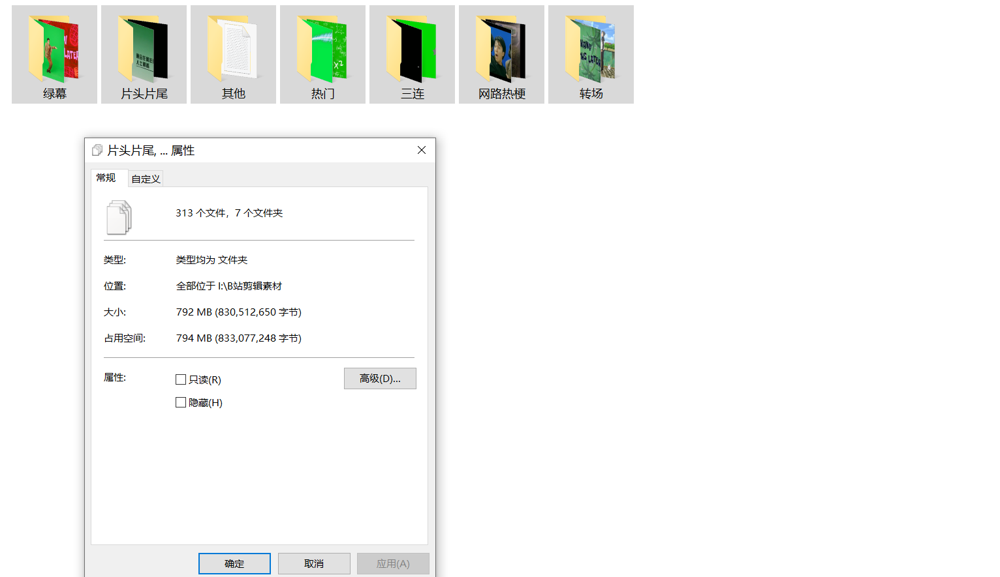
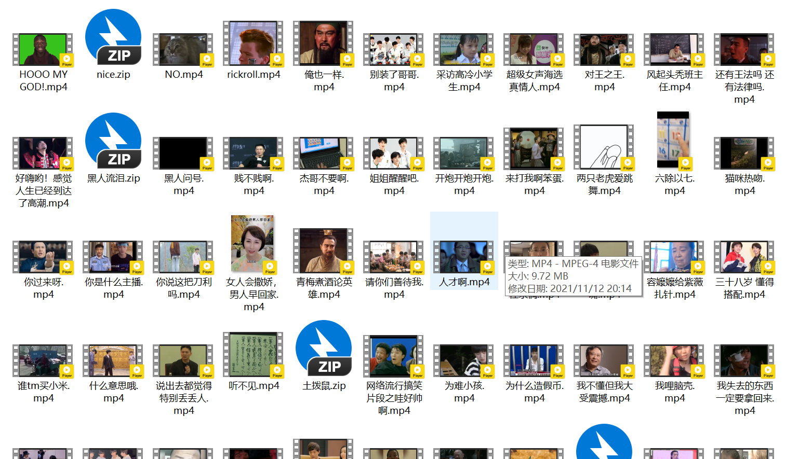
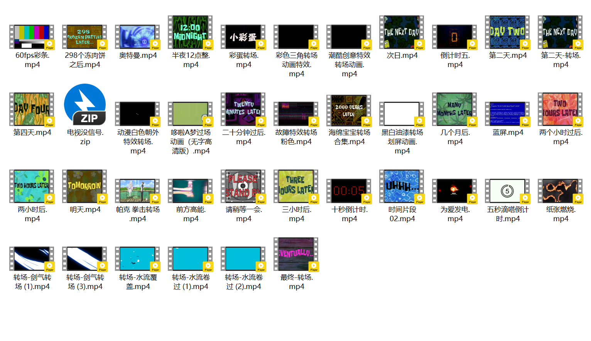

# B站素材库爬虫（含下载的素材如nice、真香、黑人问号等网络热梗和其他转场或绿幕素材）

## 爬虫采集的结果

```
链接：https://pan.baidu.com/s/1W2g6tF4BtzySfrPlt0bTJw 
提取码：6666
```

## 目标网站

```
https://cool.bilibili.com/square/video
```

## 起因
最近在学习视频剪辑，学习了**Adobe Premiere**的简单操作，可以简单拼接视频进行剪辑，但是这样做出了的视频衔接生硬**缺少转场**，并且缺少**名场面**不够生动。


B站的这个素材库平台（https://cool.bilibili.com/square/video）就有相应的素材
如果在适当的添加素材就可以提升自己作品的**逼格**。


<u>但是这个网站网页版不给下载，只能在**必剪**中使用</u>，这是我不能忍受的，于是我就写了这个**小爬虫**抓取了部分视频，仅用于我学习视频剪辑素材之用，禁止用于商业用途。

## 使用方法

### 安装依赖

```bash
pip install -r requirements.txt
```

### 运行爬虫

```bash
python main.py
```

## 效果







