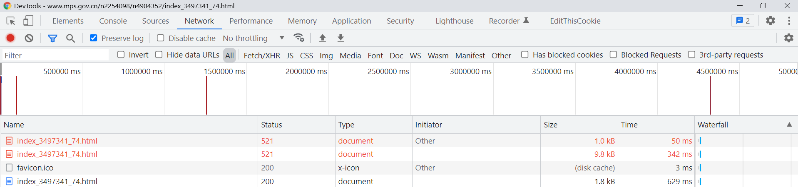
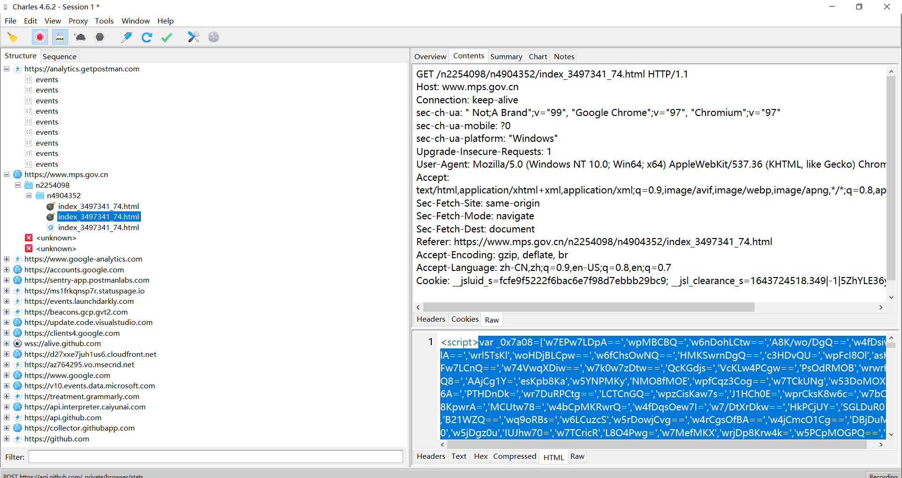

# 某信息公示平台
声明：仅用于学习之用，禁止商用，否则造成的后果与本人无关
## 网站地址
```
aHR0cHM6Ly93d3cubXBzLmdvdi5jbi9uMjI1NDA5OC9uNDkwNDM1Mi9pbmRleF8zNDk3MzQxXzc0Lmh0bWw=
```

## 调试过程
浏览器调试时发现，正常返回前都会有两次521，并且看不到相应的内容（使用状态码欺骗，让浏览器不保存）。


可以使用fiddler或Charles相关的抓包工具就可以看到了。


第一次521
直接在header中设置cookie,直接使用set-cookie 应该是为了辨别用户的 `__jsluid_s`  

在script标签中用js生成 cookie `__jsl_clearance_s` （假，但有用）
```
<script>document.cookie=('_')+('_')+('j')+('s')+('l')+('_')+('c')+('l')+('e')+('a')+('r')+('a')+('n')+('c')+('e')+('_')+('s')+('=')+(-~[]+'')+(-~[5]+'')+(-~(3)+'')+((1|2)+'')+(7+'')+(0+1+0+1+'')+((2)*[2]+'')+(([2]+0>>2)+'')+(-~{}+'')+(3+5+'')+('.')+(3+'')+(-~(3)+'')+(-~(8)+'')+('|')+('-')+(-~[]+'')+('|')+(2+3+'')+('Z')+('h')+('Y')+('L')+('E')+((1+[2]>>2)+'')+((1+[2])/[2]+'')+('y')+('p')+('Y')+('i')+('R')+('P')+('r')+('l')+('f')+('j')+('e')+(-~(3)+'')+('o')+('f')+('z')+('R')+(1+5+'')+('J')+('Y')+('%')+(-~[2]+'')+('D')+(';')+('m')+('a')+('x')+('-')+('a')+('g')+('e')+('=')+((1+[2]>>2)+'')+(-~[5]+'')+(~~false+'')+(~~[]+'')+(';')+('p')+('a')+('t')+('h')+('=')+('/');location.href=location.pathname+location.search</script>
```

带上上面的两个cookie，再次请求原来的url返回还是521
内容类似[第二次521](./original.js)  
使用的obfuscator混淆，[用AST还原混淆后](./decrypt.js)  

这段代码的功能时生成真正可以使用的cookie `__jsl_clearance_s`
可以发现检测了userAgent,_phantom,Headless等，检测的东西还是比较少的，直接补上以下头部就可以使用了。

生成的cookie保存在假的document.cookie中。
```
// 补头
var window = {
  "navigator":{
    "userAgent":'Mozilla/5.0 (Windows NT 10.0; Win64; x64) AppleWebKit/537.36 (KHTML, like Gecko) Chrome/97.0.4692.99 Safari/537.36'
  }
}
var setTimeout = function(a){
  return a();
}
var document = {
  "cookie":""
}
var location = {
  "href":null,
  "pathname":null,
  "search":null
}
```
## 总结
难度系数一颗星，补环境练习