# 某瓣去广告实战与签名对抗

## 写在前面

这应该是我第一次成功修改app，以前主要是调用app的接口实现数据采集（网络爬虫），这次尝试给app去广告，最后成功了很开心，主要是跟正己大佬学的，在此特别感谢！

郑重申明，本文仅用于学习交流，禁止用于非法途径，另外也**不提供成品软件**。

## 使用的工具

| 名称                                                       | 描述                                           |
| ---------------------------------------------------------- | ---------------------------------------------- |
| 某瓣apk                                                    | 版本7.18.1 更高版本可能有壳                    |
| 雷电模拟器或安卓真机                                       | 需要root                                       |
| jadx                                                       | 反编译工具                                     |
| np管理器或mT管理器                                         | 反编译工具 ，smali代码修改                     |
| frida                                                      | hook工具，验证想法                             |
| 其他工具可参考正己大佬安卓逆向课程前四课的工具，如开发助手 | https://www.52pojie.cn/thread-1695141-1-1.html |


## 去除开屏广告

使用mt管理器的activity记录功能定位到开屏广告所在类

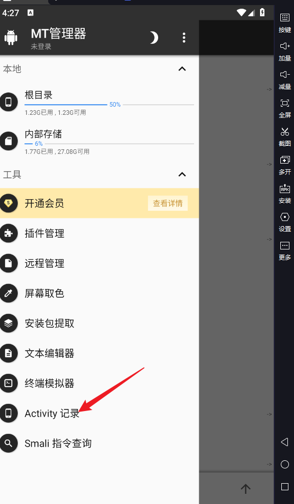


定位到开屏广告的包在`com.douban.frodo.activity.SplashActivity`，直接去这个类找了好久也没有找到关键的方法，用frida hook了一下发现好多方法在开屏阶段没有调用，表现为方法hook住了但没有输出。

没有找到从SplashActivity跳转到其他Activity的关键方法，我卡住了，我通过阅读了大量源码定位到以下这个方法`requestSplashShow`这个方法，这个方法位于`douban.ad.api`，用frida 先hook了一下发现这个方法确实有被调用，我注意到这个方法进行了异常捕获，直接return也是没有关系的。

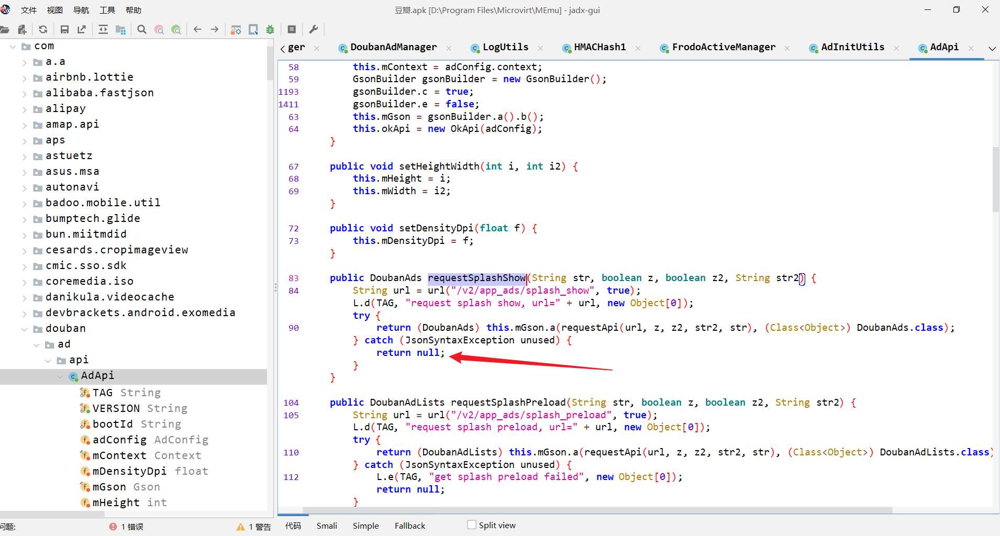

先用frida hook这个方法，直接返回null试一下，发现真的就没有广告了，这个方法成功被我嚯嚯掉了【狗头】以下是frida hook的代码。

```javascript
    let AdApi = Java.use("com.douban.ad.api.AdApi");
    AdApi["requestSplashShow"].implementation = function (str, z, z2, str2) {
    console.log(`AdApi.requestSplashShow is called: str=${str}, z=${z}, z2=${z2}, str2=${str2}`);
    // let result = this["requestSplashShow"](str, z, z2, str2);
    // console.log(`AdApi.requestSplashShow result=${result}`);
    // return result;
    return null;
};
```

使用np管理器修改对应的smali代码

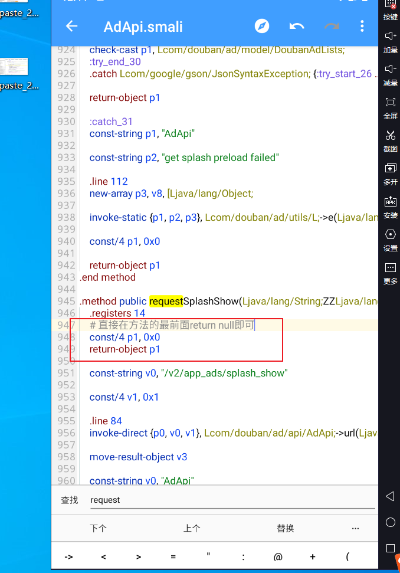、

虽然这样修改后这个方法似乎没有编译通过（np不能转成java代码），有大佬知道的话可以指点一下，我smali学的有点差，不过最起码我把这个请求广告的函数搞坏了。

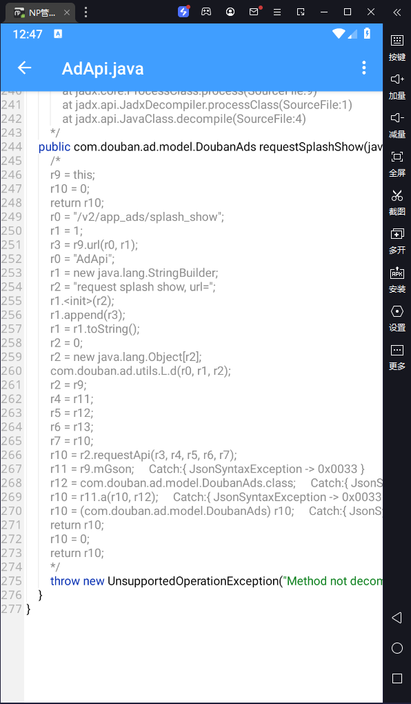

修改保存后用np管理器重新签名，**发现确实没有开屏广告了**，但是请求非法104，这个app算是废了。

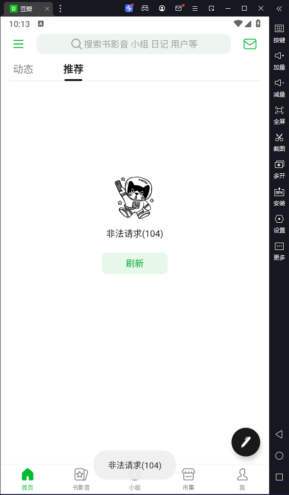


但是我之前研究过某瓣的网络请求签名“_sig”，它的签名方式是**hmachash**，而hmachash的密钥（secretkey）是根据app的签名信息动态生成的，我们对app进行了签名，生成的密钥（secretkey）不对了最后发生请求的“_sig”自然也不对了。

## 签名对抗

因为知道是请求"_sig"的有问题，可以按以下方式进行定位。

搜索关键字"_sig"

  

发现_sig 是a3

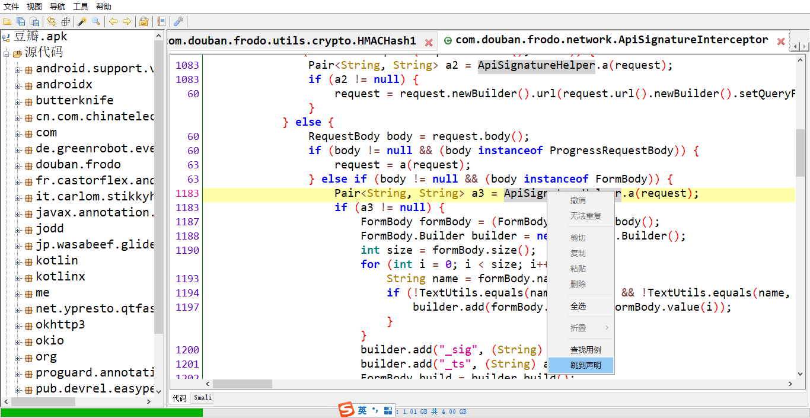  

在`com.douban.frodo.network.ApiSignatureHelper`发现了以下代码，其中str4就是hmachash 密钥，如果为了构造请求的签名直接hook str4的值即可，但我们还可以继续跟。


我们的目的是弄清楚`str4`具体的生成方法

```java
String str4 = FrodoApi.a().e.b;
```

上面代码的意思是它是FrodoApi这个类调用了a方法后e属性的b属性，可能有点绕，我们可以在jadx中双击e

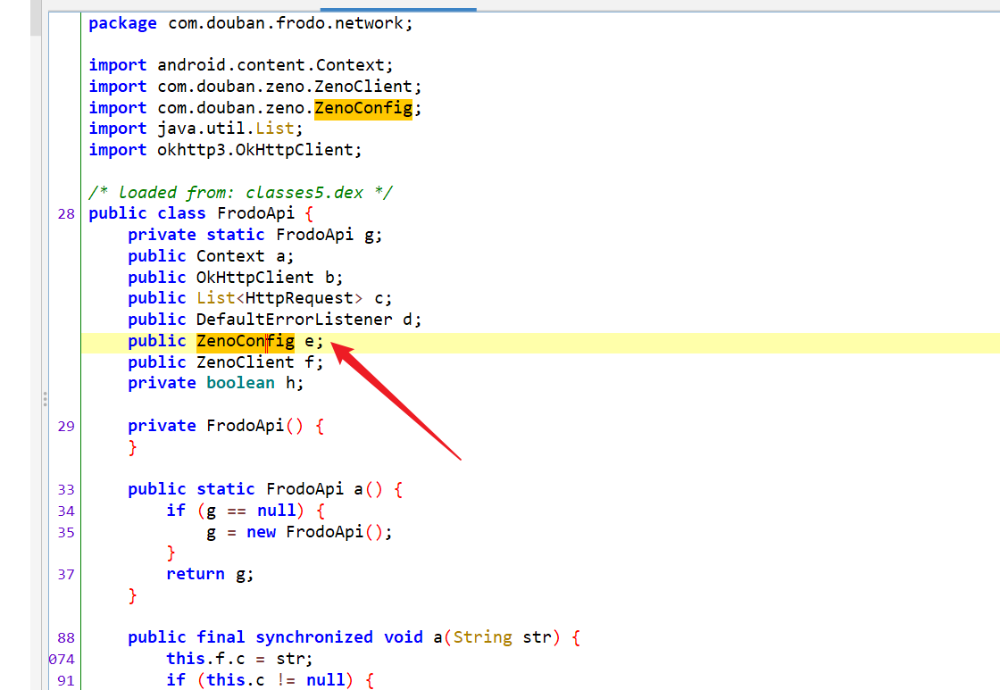


发现e是一个`ZenoConfig`类，再双击`ZenoConfig`

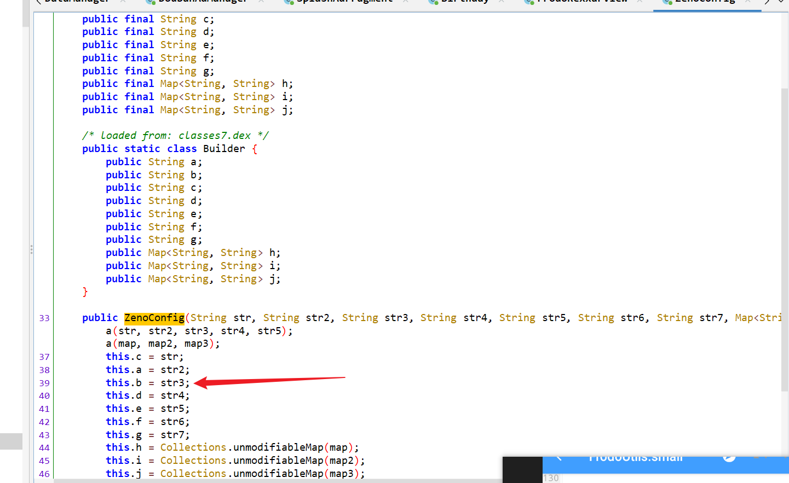

发现ZenoConfig的b是这个方法的第三个参数，也就是我们要的e.b是这个方法的第三个参数，我们可以查找用例

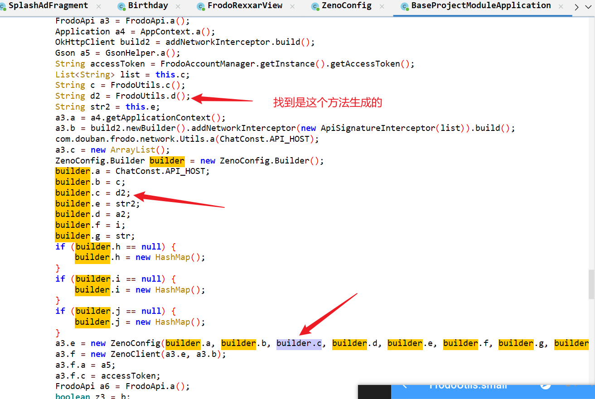


最终定位到这个方法

```java
@SuppressLint({"PackageManagerGetSignatures"})
    public static void a(boolean z) {
        if (TextUtils.isEmpty(b)) {
            b = "74CwfJd4+7LYgFhXi1cx0IQC35UQqYVFycCE+EVyw1E=";
        }
        if (TextUtils.isEmpty(c)) {
            c = "bHUvfbiVZUmm2sQRKwiAcw==";
        }
        if (z) {
            try {
                String encodeToString = Base64.encodeToString(AppContext.a().getPackageManager().getPackageInfo(AppContext.a().getPackageName(), 64).signatures[0].toByteArray(), 0);
                b = AES.a(b, encodeToString);
                c = AES.a(c, encodeToString); # hmachash的密钥（secretkey）即c
            } catch (PackageManager.NameNotFoundException e2) {
                e2.printStackTrace();
            }
        }
    }

```

以上代码说明，hmachash的密钥（secretkey）通过aes加密了apk的签名信息生成，这就解释了重新签名后网络请求非法。

我想到破解的思路就是直接将正确的`AES.a(c, encodeToString)`加密结果写死；比较通用的方法还有io重定向，签名验证的时候还是让app还是读原包，运行的时候运行修改后的包，这个方法比较高端我还没学会，所以就用前者。

关于正确值怎么来？可以安装未修改的app然后用frida hook `AES.a`这个函数，以下是`hook代码`（可以直接用jadx生成的）

```javascript
let AES = Java.use("com.douban.frodo.utils.crypto.AES");
AES["a"].overload('java.lang.String', 'java.lang.String').implementation = function (str, str2) {
    console.log(`AES.a is called: str=${str}, str2=${str2}`);
    let result = this["a"](str, str2);
    console.log(`AES.a result=${result}`);
    return result;
};
```

hook结果

```
[*] starting script
AES.a is called: str=74CwfJd4+7LYgFhXi1cx0IQC35UQqYVFycCE+EVyw1E=, str2=MIICUjCCAbsCBEty1MMwDQYJKoZIhvcNAQEEBQAwcDELMAkGA1UEBhMCemgxEDAOBgNVBAgTB0Jl
aWppbmcxEDAOBgNVBAcTB0JlaWppbmcxEzARBgNVBAoTCkRvdWJhbiBJbmMxFDASBgNVBAsTC0Rv
dWJhbiBJbmMuMRIwEAYDVQQDEwlCZWFyIFR1bmcwHhcNMTAwMjEwMTU0NjExWhcNMzcwNjI3MTU0
NjExWjBwMQswCQYDVQQGEwJ6aDEQMA4GA1UECBMHQmVpamluZzEQMA4GA1UEBxMHQmVpamluZzET
MBEGA1UEChMKRG91YmFuIEluYzEUMBIGA1UECxMLRG91YmFuIEluYy4xEjAQBgNVBAMTCUJlYXIg
VHVuZzCBnzANBgkqhkiG9w0BAQEFAAOBjQAwgYkCgYEAg622fxLuwQtC8KLYp5gHk0OmfrFiIisz
kzPLBhKPZDHjYS1URhQpzf00T8qg2oEwJPPELjN2Q7YOoax8UINXLhMgFQkyAvMfjdEOSfoKH93p
v2d4n/IjQc/TaDKu6yb53DOq76HTUYLcfLKOXaGwGjAp3QqTqP9LnjJjGZCdSvMCAwEAATANBgkq
hkiG9w0BAQQFAAOBgQA3MovcB3Hv4bai7OYHU+gZcGQ/8sOLAXGD/roWPX3gm9tyERpGztveH35p
aI3BrUWg2Vir0DRjbR48b2HxQidQTVIH/HOJHV0jgYNDviD18/cBwKuLiBvdzc2Fte+zT0nnHXMy
E6tVeW3UdHC1UvzyB7Qcxiu4sBiEO1koToQTWw==

AES.a result=0dad551ec0f84ed02907ff5c42e8ec70
AES.a is called: str=bHUvfbiVZUmm2sQRKwiAcw==, str2=MIICUjCCAbsCBEty1MMwDQYJKoZIhvcNAQEEBQAwcDELMAkGA1UEBhMCemgxEDAOBgNVBAgTB0Jl
aWppbmcxEDAOBgNVBAcTB0JlaWppbmcxEzARBgNVBAoTCkRvdWJhbiBJbmMxFDASBgNVBAsTC0Rv
dWJhbiBJbmMuMRIwEAYDVQQDEwlCZWFyIFR1bmcwHhcNMTAwMjEwMTU0NjExWhcNMzcwNjI3MTU0
NjExWjBwMQswCQYDVQQGEwJ6aDEQMA4GA1UECBMHQmVpamluZzEQMA4GA1UEBxMHQmVpamluZzET
MBEGA1UEChMKRG91YmFuIEluYzEUMBIGA1UECxMLRG91YmFuIEluYy4xEjAQBgNVBAMTCUJlYXIg
VHVuZzCBnzANBgkqhkiG9w0BAQEFAAOBjQAwgYkCgYEAg622fxLuwQtC8KLYp5gHk0OmfrFiIisz
kzPLBhKPZDHjYS1URhQpzf00T8qg2oEwJPPELjN2Q7YOoax8UINXLhMgFQkyAvMfjdEOSfoKH93p
v2d4n/IjQc/TaDKu6yb53DOq76HTUYLcfLKOXaGwGjAp3QqTqP9LnjJjGZCdSvMCAwEAATANBgkq
hkiG9w0BAQQFAAOBgQA3MovcB3Hv4bai7OYHU+gZcGQ/8sOLAXGD/roWPX3gm9tyERpGztveH35p
aI3BrUWg2Vir0DRjbR48b2HxQidQTVIH/HOJHV0jgYNDviD18/cBwKuLiBvdzc2Fte+zT0nnHXMy
E6tVeW3UdHC1UvzyB7Qcxiu4sBiEO1koToQTWw==

AES.a result=bf7dddc7c9cfe6f7
```

因此只要对代码进行如下修改就行

```java
//修改前
b = AES.a(b, encodeToString);
c = AES.a(c, encodeToString);
//修改后
b = "0dad551ec0f84ed02907ff5c42e8ec70"
c = "bf7dddc7c9cfe6f7"
```

但是java代码是不能直接改的，需要改smali代码

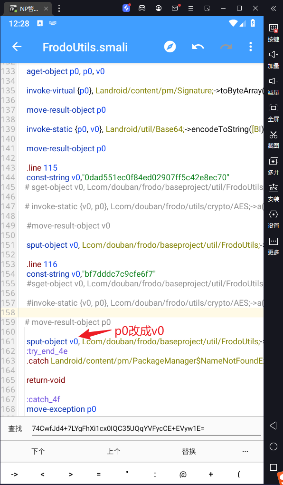

保存后重新安装app，发现正常请求到数据，并且也没有开屏广告。

## 去除推荐页的广告

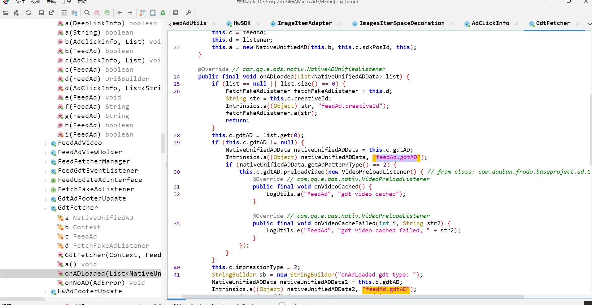

最终定位到`onADLoaded`,先用frida hook验证一下

```javascript
let GdtFetcher = Java.use("com.douban.frodo.baseproject.ad.GdtFetcher");
GdtFetcher["onADLoaded"].implementation = function (list) {
    console.log(`GdtFetcher.onADLoaded is called: list=${list}`);
    this["onADLoaded"](null);// 发现传入null后就没有推荐页的广告了，此处应该直接什么都不做也可以
 };
```

同样的用np管理器搞坏这个方法就好了，我的话是直接在方法最前面return了，似乎这个方法也没有编译通过，不过应该这个获取广告的函数坏了，所以也就没有广告了。