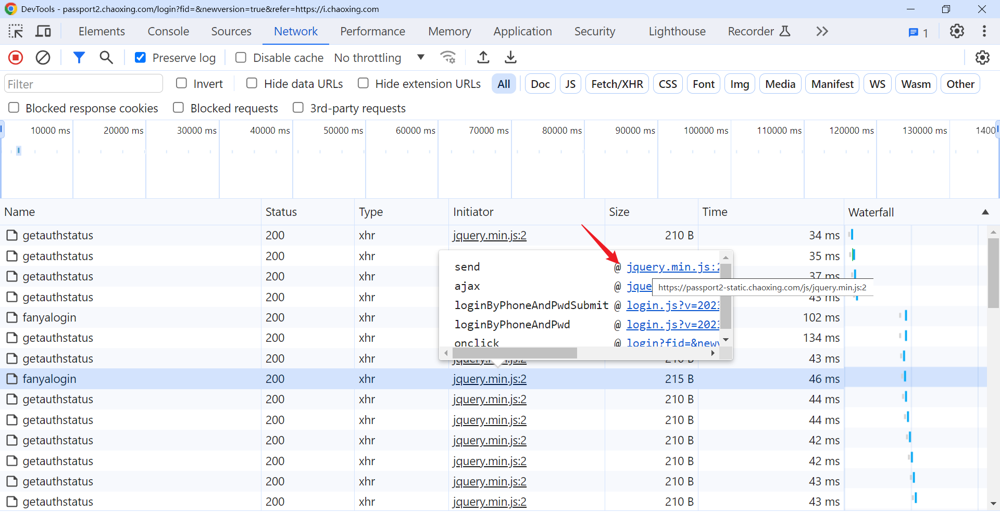
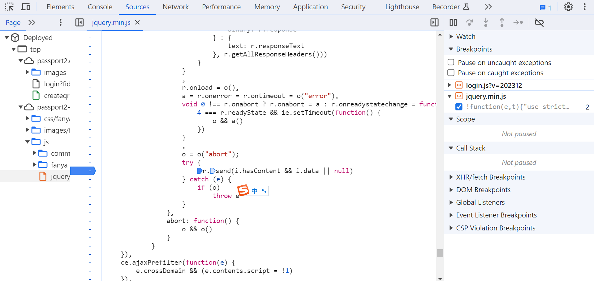
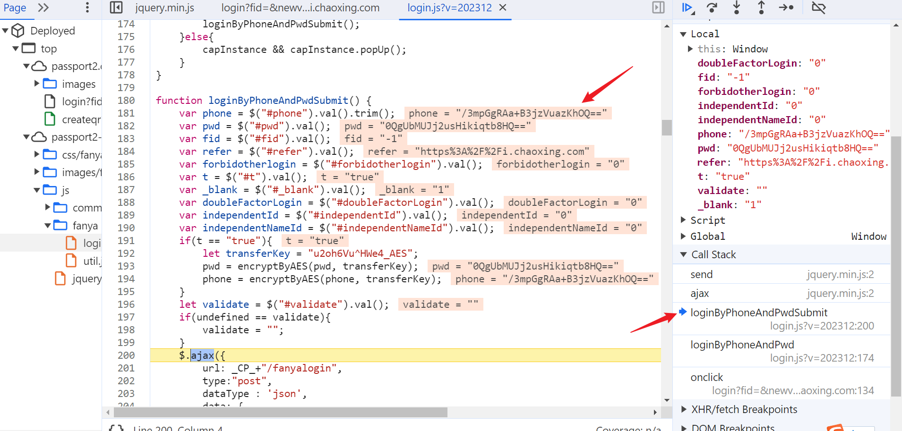
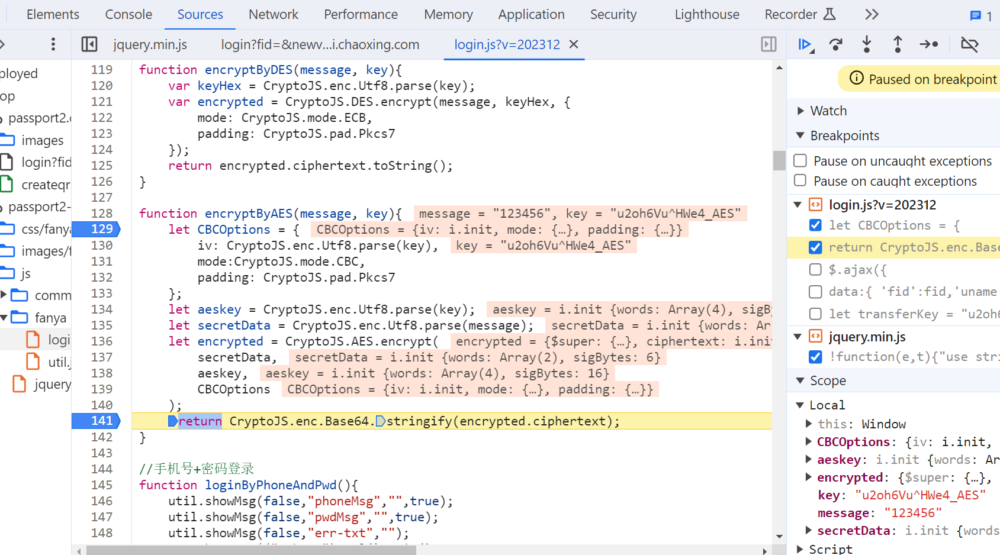
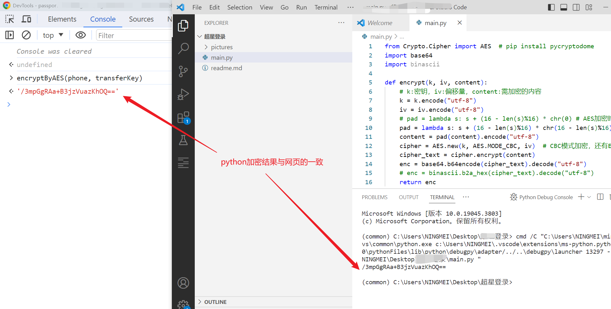

# 某通登录

## 网站

```
aHR0cHM6Ly9wYXNzcG9ydDIuY2hhb3hpbmcuY29tL2xvZ2lu (base64)
```

好久没有写文章了，今天带来一篇js逆向，加密算法是AES，**网站没有混淆适合新手**。

## 分析

F12打开抓包工具，访问登录页面点击登录，发现以下数据


只需解决uname和password的加密方式，其他参数看起来都不太重要。



打开调用栈随便打个断点，再次点击登录



往前追两个调用栈，发现此处账号密码已经完成加密，并发现关键函数encryptByAES。



进入到encryptByAES函数。



以上是AES加密的参数

加密信息是message，模式CBC，密钥和iv都是 "u2oh6Vu^HWe4_AES"，填充模式PKCS7，都非常常规。

## 代码

```python
from Crypto.Cipher import AES  # pip install pycryptodome
import base64
import binascii

def encrypt(k, iv, content):
    # k:密钥，iv:偏移量，content:需加密的内容
    k = k.encode("utf-8")
    iv = iv.encode("utf-8")
    # pad = lambda s: s + (16 - len(s)%16) * chr(0) # AES加密时，明文长度需为16的倍数。这里的pad用来填充，chr(0)表示为ZeroPadding，在最后填充0直到长度为16的倍数
    pad = lambda s: s + (16 - len(s)%16) * chr(16 - len(s)%16) # 这里为Pkcs7填充
    content = pad(content).encode("utf-8")
    cipher = AES.new(k, AES.MODE_CBC, iv)  # CBC模式加密，还有ECB模式
    cipher_text = cipher.encrypt(content)
    enc = base64.b64encode(cipher_text).decode("utf-8")
    # enc = binascii.b2a_hex(cipher_text).decode("utf-8")
    return enc
    
    
k = "u2oh6Vu^HWe4_AES"
iv = "u2oh6Vu^HWe4_AES"
print(encrypt(k, iv, "13512341234"))
```

