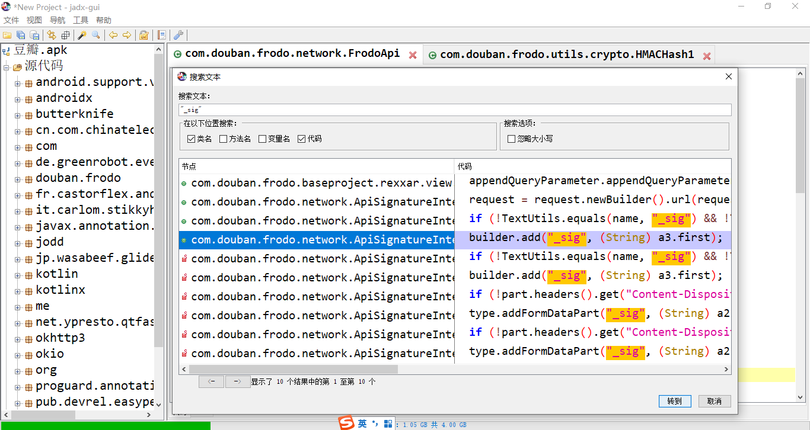
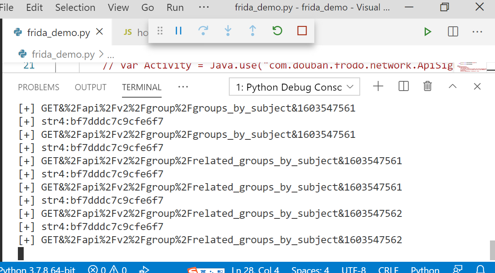

## 搜索关键字"_sig"
  

## 发现_sig 是a3
  

## a3 经过了hamchash 密钥是str4（关键）


## str4 的获得比较麻烦使用frida hook
```
setImmediate(function(){
    Java.perform(function(){
        send("starting script");        
        // var Activity = Java.use("com.douban.frodo.network.ApiSignatureHelper");
        // 定位到要hook的类名
        var HMACHash1 = Java.use("com.douban.frodo.utils.crypto.HMACHash1");
        send(HMACHash1);
        // hook 这个类的a 方法
        HMACHash1.a.implementation = function(str, str2){
            send("str4:"+str);
            send(str2);
            return HMACHash1.a(str, str2);
        };     
    });
});

```

## 最终效果


