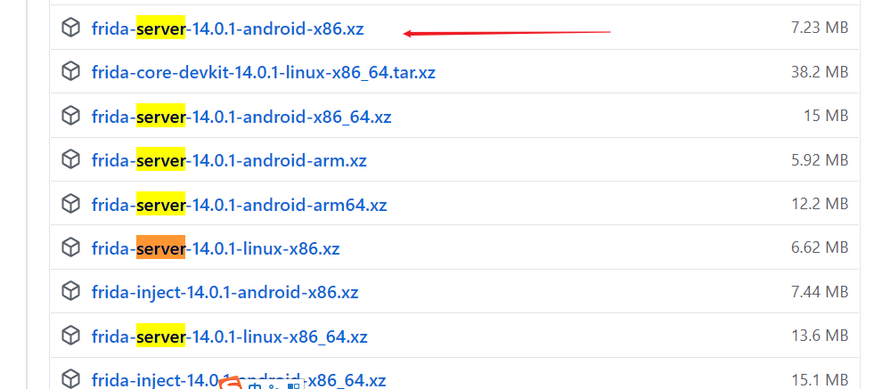

[1.豆瓣_sig参数逆向](./doubanAppSigHook.md)

# frida 环境搭建
> https://www.jianshu.com/p/8118c4842408

## 根据CPU架构选择frida-server
下载地址：https://github.com/frida/frida/releases


## 连接安卓模拟器
```
adb connect 127.0.0.1:port
```
> 夜神模拟器 adb connect 127.0.0.1:62001  
> 逍遥模拟器 adb connect 127.0.0.1:21503  
> 木木模拟器 adb connect 127.0.0.1:7555  

## 安装安卓模拟器逆向环境

将下载好的frida-server 推入安卓模拟器中
这里使用的是`逍遥模拟器`

现在已经是frida-server-14.0.1-android-x86.xz
```
# 将下载好的文件**解压后**推入指定安卓模拟器目录中
adb push frida-server-14.0.1-android-x86 /data/local
# 打开安卓模拟器shell
adb shell
# 进去目录
cd /data/local
# 改变文件权限
chmod 777 frida-server-14.0.1-android-x86
# 查看是否改变文件权限
ls -all
# 启动服务
./frida-server-14.0.1-android-x86
```

## PC端安装python的包
```
# pip安装组件
pip install frida
pip install frida-tools 
```
## PC端验证 frida-server 是否成功
```
# 端口转发
adb forward tcp:27042 tcp:27042
adb forward tcp:27043 tcp:27043
 
frida-ps -R
# 或
frida-ps -U
```

至此frida的环境搭建完成

