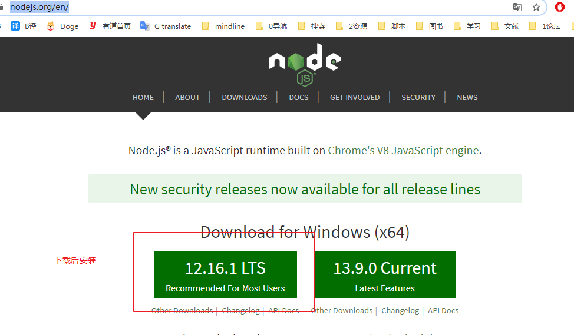
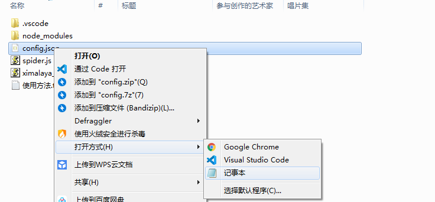
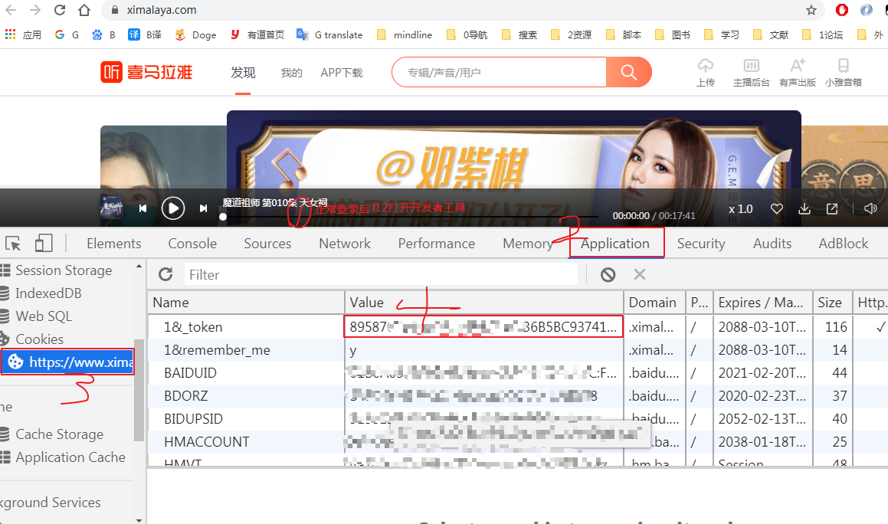
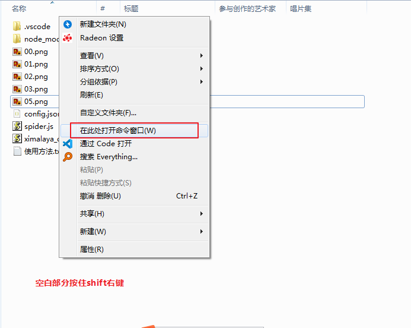
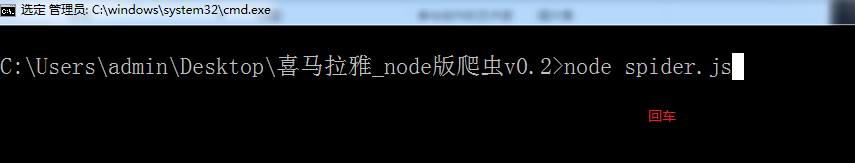

# 喜马拉雅有声书爬虫
纯JavaScript爬虫  
通过fileId和ep等参数还原真实地址
直接扣代码即可

# node.js

# install
`
npm install
`

# usage
**仅支持vip免费，并非破解需要会员登录后的cookie中的1&_token值**

网速很慢看不到图片的可以直接下载这个版本（已经安装了依赖） https://www.lanzoux.com/iGX43fxd36f

1. 安装nodejs环境并安装相关依赖
安装依赖的方法,在ximalaya_node目录下cmd命令
```cmd
npm install
```


2. 配置文件打开方法  
   

3. 复制1&_token的value值（**图02**） 
   

4. 更改配置文件  
   

5. 打开cmd  
   

6. 开始下载
   ximalaya_node目录下cmd命令

```cmd
node spider.js
```
 


